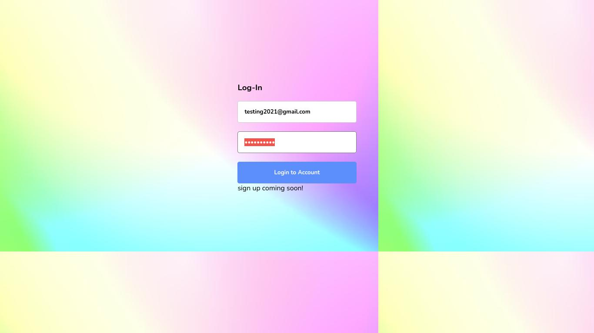
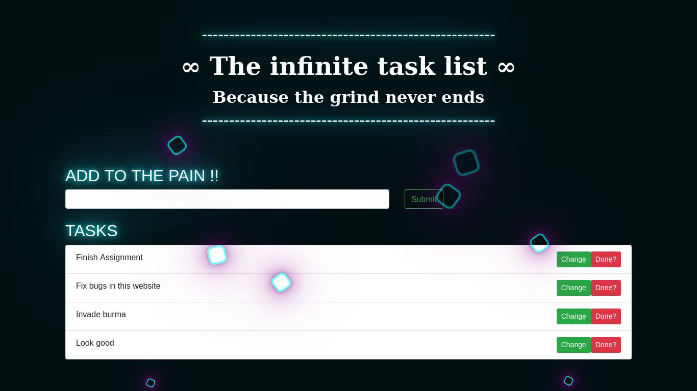
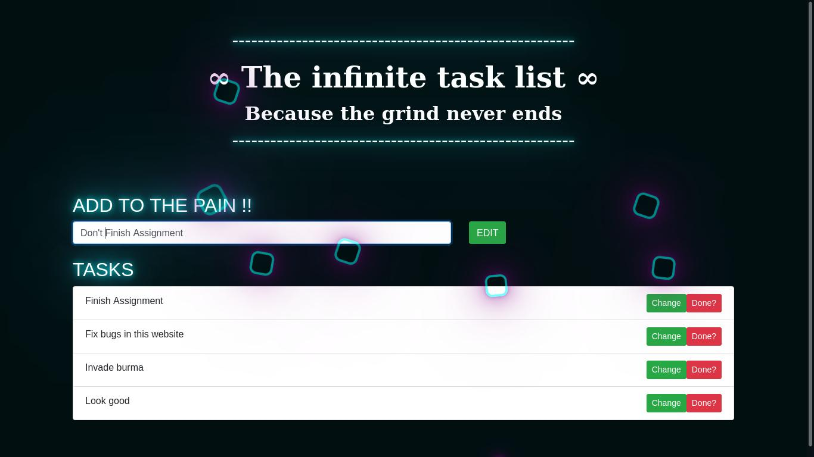
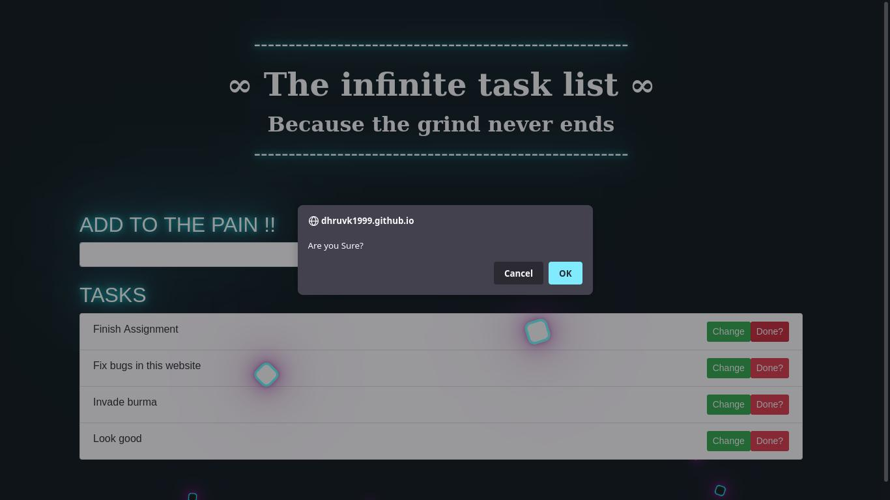

<h2><a href="dhruvk1999.github.io"> dhruvk1999.github.io </a></h2>
<h3>Login Credentials for Testing : (As of now the user has to be added thorough the backend directly)</h3>
<li>User Id: testing2021@hotmail.com </li>
<li>Password : 123456789 </li>
<h3>Tech Stack : </h3>
<li>Firebase - For login and Authentication </li>
<li>Deployed through/Environment : Github Pages</li>
<li>HTML,CSS,JS</li>
<h2>Features</h2> 
<li> Login/Authentication using firebase</li>
<li> Adding New tasks</li>
<li> Marking tasks as done</li>
<li> Editing previously added tasks</li> 
<li> Awesome UI</li>
<li> Ugly login page</li>
<li><h2>Login page </h2></li>
 
<li><h2>To-do List Page<h2></li>
  

<li><h2>Editting an Entry <h2></li>
  

<li><h2>Marking a task as done<h2></li>
  

 

 
